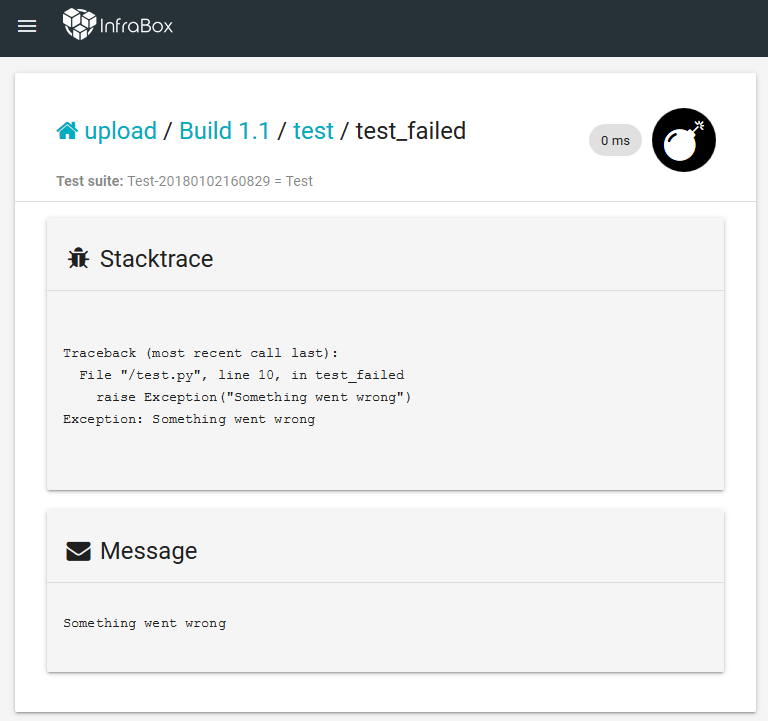

Upload test results
===================

This examples demonstrates how you can upload your test results and get them visualized by InfraBox.
Basically all you have to do is to copy your result file to _/infrabox/upload/testresult_. InfraBox then tries to automatically detect the format of it and show the results in the UI like this:

For a list of all supported file formats have a look at the [documentation](https://infrabox.ninja/docs/#upload-testresult).
